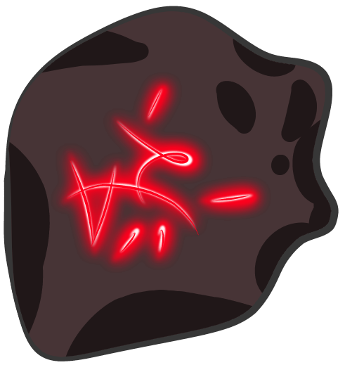

<!-- game image here -->

 # Intersect Resurrect and DANCE! Connect Four!

#### Can you place the stones before your opponent? Can your cult dance summon your Dival before the other? Will my mind ever make any sense? I know one of these is a no, but which one? Find out by playing *Intersect Resurrect and DANCE! Connect Four!* today!

 
 

# Getting Started   

### Rules
* Players must connect 4 of their pieces in a row to win, (diagonally, horizontally, vertically) while also preventing their opponent from doing so.
 

* On your turn, choose a column to drop your playing piece. 
    
    - If there are no pieces in the column, your piece will go to the bottom. 
    - If there are pieces and a space is left in that column, your piece will go to the space above the highest occupied space. 
    - If the column is full of pieces and there are no spaces left, you must choose a different column.
    - If there are no spaces left for any pieces, it is a tie.
 

### Click 'play game' below to start playing! 
 

---

# [Play Game!](https://intersect-resurrect-and-dance-c4.netlify.app/ "link to game")

 
 

# Technologies used   

* CSS 
* JavaScript
* HTML
* FireAlpaca
* git
* [Planning/Pseudocode](https://docs.google.com/document/d/1w5DGXwZ7LdfSgmjjILCHvqyxNmkBbq5HKk6fkJ9SR4s/edit#heading=h.21wptgo2t5wd "google doc planning and pseudocode")

 
 

# Attributions and Credits   
### * SoundFX and Music by [Richard Leverone!](https://www.bandmix.com/richard-leverone/ "Richard Leverone's homepage")

 

### * Support and Encouragement by my chaos coordinating instructors and comrade cohort family at [General Assembly!](https://generalassemb.ly/ "my LinkedIn")

 

### * Favicon created by me through the use of [favicon.cc!](https://www.favicon.cc/ "favicon.cc website")

 

### * Font is _"Ole"_ by Robert Leuschke, found on [Google Fonts!](https://fonts.google.com/?query=Robert+Leuschke "link to Google Fonts query of Robert Leuschke's fonts")

 

### * Graphics and Development by Ayala Murúch [(me!)](https://www.linkedin.com/in/ayalamuruch/ "my LinkedIn")

 

### * Animation code bases are from [Animate.css!](https://animate.style/ "animate.css website")

 
 

# Recent Changes 
* Changed player piece image/icons
* Modified art to background
* Added background music

 
 

# Future Plans and Enhancements 

- [ ] Add a light/dark mode
- [ ] Add an animation pause/play button
- [ ] Add a title screen
- [ ] Add rules to title screen
- [ ] Add button on title screen to go to battle(main) screen
- [ ] Add audio to title to main screen button
- [ ] Add additional characters:

  - Detective Anubis
  - Morrigan LeFlemming
  - Jilled and Louvour

- [ ] Add additional backgrounds to go with new characters:

  - Captain Mothman ship
  - Detective Anubis background
  - Morrigan Arcadi-Nog hut in the forest
  - Jilled and Louvour 'Outer Space of Love' amusement park ride
   
   
---
# [Play Game!](https://intersect-resurrect-and-dance-c4.netlify.app/ "link to game")
